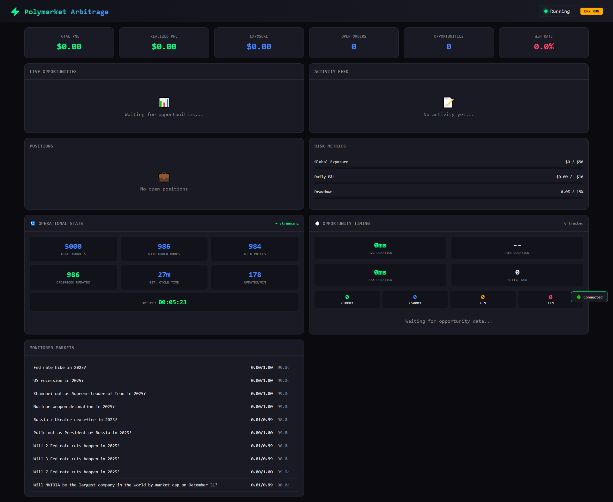
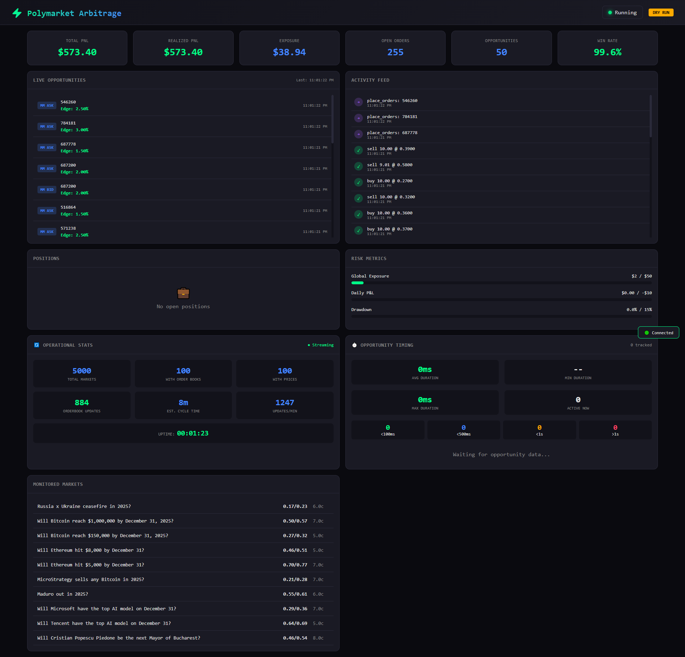

# Polymarket Arbitrage Bot

<div align="center">


**A real-time arbitrage detection and market-making bot for Polymarket prediction markets**

[Features](#-features) • [Demo](#-demo) • [Quick Start](#-quick-start) • [Dashboard](#-live-dashboard) • [Configuration](#%EF%B8%8F-configuration)

**Author: [ImMike](https://github.com/ImMike)**

</div>

---

## 🎬 Demo

### Video Demo

https://github.com/user-attachments/assets/polymarket-arb-demo.mp4

*Watch the bot in action - scanning 5,000+ markets and finding opportunities in real-time*

### Screenshots

<div align="center">

#### 📊 Real Market Data Mode
*Scanning 5,000+ live Polymarket markets*



#### 🧪 Simulation Mode  
*Testing with simulated opportunities - 99.6% win rate, $573 profit*



</div>

---

## 🎯 Features

- **🔍 Bundle Arbitrage Detection** - Identifies when YES + NO prices don't sum to ~$1.00
- **📊 Market Making** - Captures spreads by placing competitive bid/ask orders  
- **🛡️ Risk Management** - Position limits, loss limits, kill switch
- **📈 Live Dashboard** - Real-time web UI showing opportunities and bot activity
- **🔄 Dual Data Modes** - Switch between real market data and simulation
- **💰 Fee Accounting** - Realistic edge calculations including fees & gas costs
- **📝 Comprehensive Logging** - Detailed logs for trades, opportunities, and errors

---

## 🔄 Data Modes

The bot supports two data modes, configurable in `config.yaml`:

### 🧪 Simulation Mode (for demos & testing)

```yaml
mode:
  data_mode: "simulation"  # Generates fake data with opportunities
```

- Generates simulated order books with realistic price dynamics
- Periodically introduces mispricings to create arbitrage opportunities
- Perfect for **screenshots, demos, and testing strategies**
- Fast updates to see the bot in action

### 🌐 Real Mode (for live trading)

```yaml
mode:
  data_mode: "real"  # Fetches actual Polymarket data
```

- Connects to **Polymarket's Gamma API** for market discovery
- Fetches **real order books** from the CLOB (Central Limit Order Book) API
- Scans **5,000+ markets** across all categories
- Real markets are highly efficient - arbitrage opportunities are rare!

---

## 📁 Project Structure

```
polymarket-arbitrage/
├── main.py                   # Main entry point
├── run_with_dashboard.py     # Bot + live dashboard
├── config.yaml               # Configuration (edit this!)
├── requirements.txt          # Python dependencies
│
├── polymarket_client/        # API client
│   ├── api.py               # REST + WebSocket integration
│   └── models.py            # Data classes
│
├── core/                     # Trading logic
│   ├── data_feed.py         # Real-time market data manager
│   ├── arb_engine.py        # Opportunity detection
│   ├── execution.py         # Order management
│   ├── risk_manager.py      # Risk limits & kill switch
│   └── portfolio.py         # Position & PnL tracking
│
├── dashboard/                # Web dashboard
│   ├── server.py            # FastAPI server
│   └── integration.py       # Bot-dashboard bridge
│
├── utils/                    # Utilities
│   ├── config_loader.py     # YAML config parser
│   ├── logging_utils.py     # Colored console logging
│   └── backtest.py          # Backtesting engine
│
├── tests/                    # Unit tests
│   ├── test_arb_engine.py
│   ├── test_risk_manager.py
│   └── test_portfolio.py
│
└── logs/                     # Log files (auto-created)
```

---

## 🚀 Quick Start

### 1. Clone & Install

```bash
git clone https://github.com/ImMike/polymarket-arbitrage.git
cd polymarket-arbitrage

# Create virtual environment (recommended)
python -m venv venv
source venv/bin/activate      # Linux/Mac
venv\Scripts\activate         # Windows

# Install dependencies
pip install -r requirements.txt
```

### 2. Configure

Edit `config.yaml`:

```yaml
mode:
  trading_mode: "dry_run"     # Start with dry run!
  data_mode: "simulation"     # Use "real" for live data

trading:
  min_edge: 0.01              # 1% minimum edge
  default_order_size: 5       # Start small

risk:
  max_position_per_market: 15
  max_global_exposure: 50
  max_daily_loss: 10
```

### 3. Run with Dashboard

```bash
# Run bot with live dashboard
python run_with_dashboard.py

# Open http://localhost:8000 in your browser
```

### 4. Other Run Modes

```bash
# Bot only (no dashboard)
python main.py

# Verbose logging
python main.py -v

# Specify config file
python main.py --config config.live.yaml
```

---

## 📊 Live Dashboard

The dashboard provides real-time visibility into bot operations:

<div align="center">

| Metric | Description |
|--------|-------------|
| **Opportunities** | Bundle arb & market-making signals found |
| **Markets Monitored** | Total markets being scanned |
| **Order Books** | Markets with live price data |
| **Uptime** | Bot running time |
| **PnL** | Profit/Loss tracking |

</div>

Access at `http://localhost:8000` when running with `run_with_dashboard.py`

---

## 📈 Trading Strategies

### Bundle Arbitrage

Detects when YES + NO tokens are mispriced:

| Condition | Action | Profit |
|-----------|--------|--------|
| `ask_yes + ask_no < $1.00` | Buy both | Guaranteed $1 payout |
| `bid_yes + bid_no > $1.00` | Sell both | Lock in premium |

**Example**: If YES trades at $0.45 and NO at $0.52, buying both costs $0.97 but pays out $1.00 = **3% profit**

### Market Making

Places orders inside wide spreads:

1. If spread ≥ 5¢, place bid slightly above best bid
2. Place ask slightly below best ask  
3. Profit when both sides fill

---

## ⚙️ Configuration

### Key Parameters

| Section | Parameter | Description | Default |
|---------|-----------|-------------|---------|
| `mode` | `trading_mode` | `"dry_run"` or `"live"` | `dry_run` |
| `mode` | `data_mode` | `"simulation"` or `"real"` | `simulation` |
| `trading` | `min_edge` | Min profit after fees | 0.01 (1%) |
| `trading` | `min_spread` | Min spread for MM | 0.05 (5¢) |
| `trading` | `mm_enabled` | Enable market making | true |
| `risk` | `max_position_per_market` | Max $ per market | 200 |
| `risk` | `max_global_exposure` | Max total exposure | 5000 |
| `risk` | `max_daily_loss` | Stop-loss limit | 500 |

### Fee Configuration

```yaml
trading:
  maker_fee_bps: 0            # Polymarket maker fee (0%)
  taker_fee_bps: 0            # Polymarket taker fee (0%)
  estimated_gas_per_order: 0.001  # Polygon gas (minimal)
```

### Environment Variables

Store sensitive data in environment variables:

```bash
export POLYMARKET_API_KEY="your_api_key"
export POLYMARKET_PRIVATE_KEY="your_private_key"
```

---

## 🧪 Testing

```bash
# Run all tests
pytest tests/ -v

# Run specific test
pytest tests/test_arb_engine.py -v

# With coverage report
pytest tests/ --cov=core --cov=polymarket_client
```

---

## 📊 How It Works

```
┌─────────────────────────────────────────────────────────────────┐
│                         DATA FLOW                               │
├─────────────────────────────────────────────────────────────────┤
│                                                                 │
│  ┌──────────────┐    ┌──────────────┐    ┌──────────────┐      │
│  │  Polymarket  │───▶│  Data Feed   │───▶│  Arb Engine  │      │
│  │  APIs        │    │  (orderbooks)│    │  (detection) │      │
│  └──────────────┘    └──────────────┘    └──────┬───────┘      │
│                                                  │              │
│                                                  ▼              │
│  ┌──────────────┐    ┌──────────────┐    ┌──────────────┐      │
│  │  Dashboard   │◀───│  Portfolio   │◀───│  Execution   │      │
│  │  (web UI)    │    │  (tracking)  │    │  (orders)    │      │
│  └──────────────┘    └──────────────┘    └──────────────┘      │
│                             ▲                    │              │
│                             │                    ▼              │
│                      ┌──────────────┐    ┌──────────────┐      │
│                      │   Logging    │◀───│    Risk      │      │
│                      │              │    │   Manager    │      │
│                      └──────────────┘    └──────────────┘      │
│                                                                 │
└─────────────────────────────────────────────────────────────────┘
```

---

## ⚠️ Important Notes

### About Real Markets

> **Real prediction markets are highly efficient.** Arbitrage opportunities are rare and fleeting. The bot is designed to catch them when they occur, but don't expect constant profits.

### Risk Warnings

1. **🧪 Start in dry run mode** - Always test before using real money
2. **💵 Start small** - Begin with minimal capital ($50-100)
3. **👀 Monitor actively** - Don't leave running unattended
4. **📉 Expect losses** - Trading always carries risk
5. **🔬 This is experimental** - Use at your own risk

### Polymarket Notes

- Polymarket uses a **hybrid model**: centralized order matching, on-chain settlement
- No gas fees for trading (Polymarket covers them)
- Funds are held in USDC on Polygon
- API keys required for live trading

---

## 🔧 Development

### Adding New Strategies

1. Add detection logic in `core/arb_engine.py`
2. Create `Opportunity` objects with entry/exit prices
3. Execution engine handles order placement

### Extending the Dashboard

The dashboard uses FastAPI + vanilla JS. Add new endpoints in `dashboard/server.py` and update the HTML in `get_embedded_html()`.

---

## 📄 License

MIT License - See [LICENSE](LICENSE) for details

---

## 👤 Author

**[ImMike](https://github.com/ImMike)**

- GitHub: [@ImMike](https://github.com/ImMike)

---

## 🤝 Contributing

1. Fork the repository
2. Create a feature branch (`git checkout -b feature/amazing-feature`)
3. Commit changes (`git commit -m 'Add amazing feature'`)
4. Push to branch (`git push origin feature/amazing-feature`)
5. Open a Pull Request

---

<div align="center">

**⚠️ Disclaimer**: This software is for educational purposes. Trading prediction markets involves risk of loss. Past performance does not guarantee future results. Always do your own research.

Made with ☕ and Python by [ImMike](https://github.com/ImMike)

</div>
